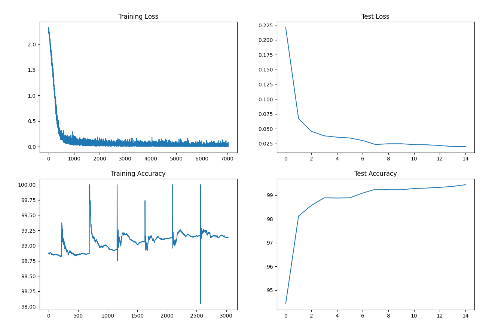

# MNIST Digit Classification Model

- **Parameters**: 7,544 (all trainable)
- **Model Size**: 0.68 MB
- **Architecture Overview**:
  - 8 Convolutional layers
  - Batch Normalization after each conv layer
  - Dropout for regularization
  - Global Average Pooling before final layer
  - No Fully Connected layers (except final prediction layer)

## Training Parameters

- **Optimizer**: SGD with Nesterov Momentum
  - Initial Learning Rate: 0.01
  - Momentum: 0.9
  - Weight Decay: 0.0001
  - Nesterov: True

- **Learning Rate Scheduler**: OneCycleLR
  - Max Learning Rate: 0.02
  - Epochs: 15
  - Pct Start: 0.2
  - Division Factor: 25
  - Final Division Factor: 1e4
  - Annealing Strategy: Cosine
  - Momentum Range: 0.85 to 0.95

- **Batch Size**: 
  - 128 (with CUDA)
  - 64 (without CUDA)

## Results

### Training Progress
- Epoch 1: 96.60% train accuracy, 98.30% test accuracy
- Epoch 5: 98.49% train accuracy, 99.11% test accuracy
- Epoch 10: 98.92% train accuracy, 99.31% test accuracy
- Epoch 15: 99.21% train accuracy, 99.41% test accuracy

### Key Achievements
- **Target Accuracy**: 99.4%
- **Achieved Accuracy**: 99.41%
- **Best Test Loss**: 0.0186
- **Convergence**: Model showed consistent improvement throughout training
- **Training Time**: ~20-35 iterations per second on GPU

### Notable Features
- Reached 96%+ accuracy in the first epoch
- Crossed 99% training accuracy by epoch 11
- Maintained stable performance without overfitting
- Achieved target accuracy with a lightweight model (<8K parameters)

## Logs:
```

 mnist_low_param_model_v2  python train.py
----------------------------------------------------------------
        Layer (type)               Output Shape         Param #
================================================================
            Conv2d-1           [-1, 16, 26, 26]             144
              ReLU-2           [-1, 16, 26, 26]               0
       BatchNorm2d-3           [-1, 16, 26, 26]              32
           Dropout-4           [-1, 16, 26, 26]               0
            Conv2d-5           [-1, 10, 24, 24]           1,440
              ReLU-6           [-1, 10, 24, 24]               0
       BatchNorm2d-7           [-1, 10, 24, 24]              20
           Dropout-8           [-1, 10, 24, 24]               0
            Conv2d-9           [-1, 10, 24, 24]             100
        MaxPool2d-10           [-1, 10, 12, 12]               0
           Conv2d-11           [-1, 10, 10, 10]             900
             ReLU-12           [-1, 10, 10, 10]               0
      BatchNorm2d-13           [-1, 10, 10, 10]              20
          Dropout-14           [-1, 10, 10, 10]               0
           Conv2d-15             [-1, 10, 8, 8]             900
             ReLU-16             [-1, 10, 8, 8]               0
      BatchNorm2d-17             [-1, 10, 8, 8]              20
          Dropout-18             [-1, 10, 8, 8]               0
           Conv2d-19             [-1, 16, 6, 6]           1,440
             ReLU-20             [-1, 16, 6, 6]               0
      BatchNorm2d-21             [-1, 16, 6, 6]              32
          Dropout-22             [-1, 16, 6, 6]               0
           Conv2d-23             [-1, 16, 6, 6]           2,304
             ReLU-24             [-1, 16, 6, 6]               0
      BatchNorm2d-25             [-1, 16, 6, 6]              32
          Dropout-26             [-1, 16, 6, 6]               0
        AvgPool2d-27             [-1, 16, 1, 1]               0
           Conv2d-28             [-1, 10, 1, 1]             160
================================================================
Total params: 7,544
Trainable params: 7,544
Non-trainable params: 0
----------------------------------------------------------------
Input size (MB): 0.00
Forward/backward pass size (MB): 0.65
Params size (MB): 0.03
Estimated Total Size (MB): 0.68
----------------------------------------------------------------
None
EPOCH: 0
Loss=0.2469 Batch_id=468 Accuracy=67.13: 100%|███████████████████████████████| 469/469 [00:24<00:00, 19.38it/s] 

Test set: Average loss: 0.1555, Accuracy: 9685/10000 (96.85%)

EPOCH: 1
Loss=0.0506 Batch_id=468 Accuracy=96.60: 100%|███████████████████████████████| 469/469 [00:21<00:00, 21.72it/s] 

Test set: Average loss: 0.0607, Accuracy: 9830/10000 (98.30%)

EPOCH: 2
Loss=0.0860 Batch_id=468 Accuracy=97.75: 100%|███████████████████████████████| 469/469 [00:21<00:00, 21.82it/s] 

Test set: Average loss: 0.0442, Accuracy: 9874/10000 (98.74%)

EPOCH: 3
Loss=0.0643 Batch_id=468 Accuracy=98.13: 100%|███████████████████████████████| 469/469 [00:23<00:00, 19.96it/s] 

Test set: Average loss: 0.0347, Accuracy: 9893/10000 (98.93%)

EPOCH: 4
Loss=0.0562 Batch_id=468 Accuracy=98.39: 100%|███████████████████████████████| 469/469 [00:25<00:00, 18.36it/s] 

Test set: Average loss: 0.0356, Accuracy: 9900/10000 (99.00%)

EPOCH: 5
Loss=0.0183 Batch_id=468 Accuracy=98.49: 100%|███████████████████████████████| 469/469 [00:29<00:00, 15.91it/s] 

Test set: Average loss: 0.0292, Accuracy: 9911/10000 (99.11%)

EPOCH: 6
Loss=0.0448 Batch_id=468 Accuracy=98.57: 100%|███████████████████████████████| 469/469 [00:26<00:00, 17.44it/s] 

Test set: Average loss: 0.0303, Accuracy: 9903/10000 (99.03%)

EPOCH: 7
Loss=0.0400 Batch_id=468 Accuracy=98.69: 100%|███████████████████████████████| 469/469 [00:26<00:00, 17.70it/s] 

Test set: Average loss: 0.0254, Accuracy: 9919/10000 (99.19%)

EPOCH: 8
Loss=0.0256 Batch_id=468 Accuracy=98.73: 100%|███████████████████████████████| 469/469 [00:26<00:00, 17.93it/s] 

Test set: Average loss: 0.0228, Accuracy: 9921/10000 (99.21%)

EPOCH: 9
Loss=0.1141 Batch_id=468 Accuracy=98.86: 100%|███████████████████████████████| 469/469 [00:24<00:00, 19.04it/s] 

Test set: Average loss: 0.0241, Accuracy: 9915/10000 (99.15%)

EPOCH: 10
Loss=0.0384 Batch_id=468 Accuracy=98.92: 100%|███████████████████████████████| 469/469 [00:13<00:00, 34.52it/s] 

Test set: Average loss: 0.0216, Accuracy: 9931/10000 (99.31%)

EPOCH: 11
Loss=0.1191 Batch_id=468 Accuracy=99.00: 100%|███████████████████████████████| 469/469 [00:12<00:00, 37.94it/s] 

Test set: Average loss: 0.0197, Accuracy: 9931/10000 (99.31%)

EPOCH: 13
Loss=0.0070 Batch_id=468 Accuracy=99.12: 100%|███████████████████████████████| 469/469 [00:12<00:00, 37.92it/s] 

Test set: Average loss: 0.0188, Accuracy: 9940/10000 (99.40%)

EPOCH: 14
Loss=0.0093 Batch_id=468 Accuracy=99.21: 100%|███████████████████████████████| 469/469 [00:12<00:00, 36.13it/s] 

Test set: Average loss: 0.0186, Accuracy: 9941/10000 (99.41%)
```


